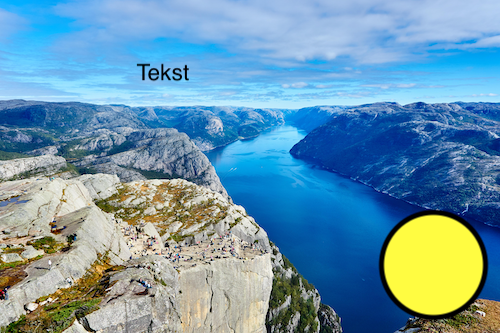
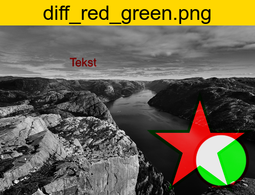
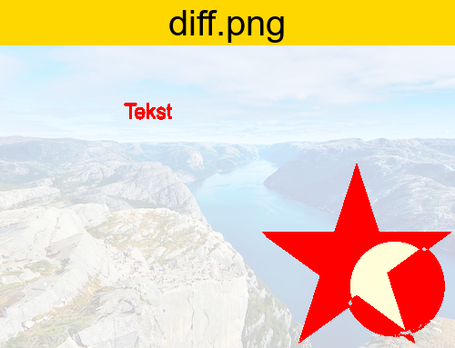
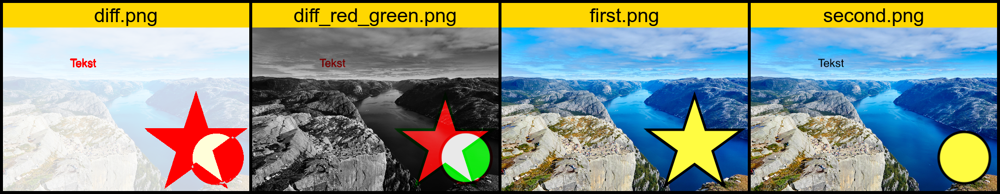

# Diff images

Script to generate diff from two image

### Parameters
|Name|Description|Default value|
|:----:|:-----------|:-----:|
|**f**|First file|-|
|**s**|Second file|-|
|**w**|Border width|3|
|**c**|Border color|black|
|**o**|Output folder|`./output_images/GENERATED`|
|**l**|Add Add labels OLD / NEW|disabled|
|**h**|Help|-|

### Examples
`./images_diff.sh -f first_file.png -s second_file.png`images_diff

With custom parameters
`./images_diff.sh -f first_file.png -s second_file.png -w 10 -o "./Downloads -l"`

### Example result
`./images_diff.sh -f first.png -s second.png`

**Input images**

|Name|Image|
|:----:|:-----------|
|`first.png`||
|`second.png`||

**Output images**

|Name|Image|
|:----:|:-----------|
|`diff_red_green.png`||
|`diff.png`||
|`merged.png`||
|`diff.gif`||

