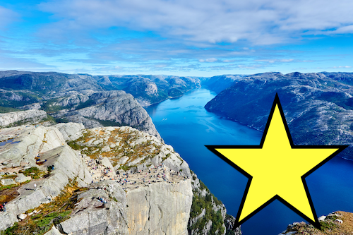
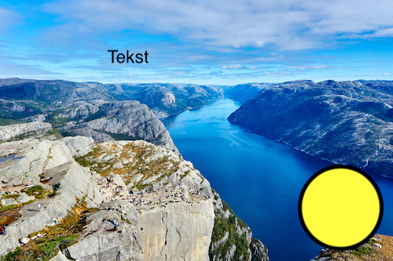

# Diff images

Script to generate visual diffs from two images with support for labels, custom colors, and multi-format output (PNG, GIF, merged montage).

### Features
- ✅ Cross-platform (macOS, Linux)
- ✅ Add labels to images with customizable titles
- ✅ Custom border width and color
- ✅ Generate diff visualizations (red/green composite)
- ✅ Create merged montage of all images
- ✅ Generate animated GIF for quick comparison
- ✅ Input validation and error handling

### Parameters

|Name|Description|Default|Required|
|:----:|:-----------|:-----:|:-----:|
|**f1**|First image file|-|Yes|
|**f2**|Second image file|-|Yes|
|**w**|Border width|3|No|
|**c**|Border color|black|No|
|**o**|Output path|`./output_images`|No|
|**l**|Add labels to images|disabled|No|
|**t1**|Custom title for first image|OLD (when -l used)|No|
|**t2**|Custom title for second image|NEW (when -l used)|No|
|**g**|Skip GIF generation|disabled|No|
|**m**|Skip merge generation|disabled|No|
|**h**|Show help|-|No|

### Examples

**Basic usage**
```bash
./images_diff.sh -f1 first.png -f2 second.png
```

**With labels and custom colors**
```bash
./images_diff.sh -f1 first.png -f2 second.png -l -c '#323a47' -w 10
```

**With custom title names**
```bash
./images_diff.sh -f1 first.png -f2 second.png -l -t1 'BEFORE' -t2 'AFTER'
```

**Quick test (skip GIF & merge)**
```bash
./images_diff.sh -f1 first.png -f2 second.png -l -g -m
```

**Show help**
```bash
./images_diff.sh -h
```

### Example result

**Input images**

|Name|Image|
|:----:|:-----------|
|`first.png`||
|`second.png`||

**Output images**

|Name|Description|
|:----:|:-----------|
|`diff_red_green.png`|Red/green composite diff visualization|
|`diff.png`|AE metric diff with red highlights|
|`merged.png`|Montage of all 5 images (before, after, diff, diff_red_green, with labels)|
|`diff.gif`|Animated GIF alternating between images|

### Output Structure
```
output_images/GENERATED/
├── before.png              # Original first image with title
├── after.png               # Original second image with title
├── diff.png                # AE metric diff
├── diff_red_green.png      # Red/green visualization
├── merged.png              # Montage of all 5 images
└── diff.gif                # Animated comparison
```

### Installation

Requires ImageMagick and FFmpeg:
```bash
# macOS
brew install imagemagick ffmpeg

# Linux (Ubuntu/Debian)
sudo apt-get install imagemagick ffmpeg

# Linux (Fedora)
sudo dnf install ImageMagick ffmpeg
```

### Recent Improvements

See [IMPROVEMENTS.md](./IMPROVEMENTS.md) for details on latest updates:
- Cross-platform font support (macOS & Linux)
- Input file validation
- New skip options for faster testing
- Better error handling and cleanup
- Proper array/variable quoting
- Consistent parameter passing

